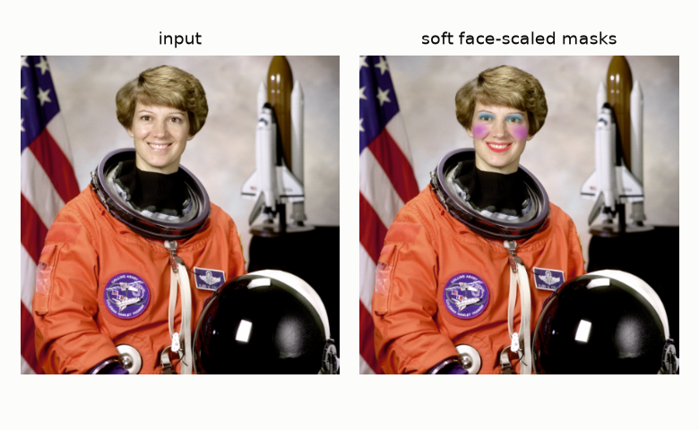

# Virtual Makeup Studio

**Landmark-driven virtual makeup that recolors lips, lids and cheeks without destroying skin texture — with a live camera try-on that runs entirely in your browser.**

[**Live studio → try it on your own camera**](https://safdar-hussain1.github.io/virtual-makeup/) · [Engineering notebook](notebooks/01_engine_and_baselines.ipynb)


## What it is

A virtual makeup engine, shipped two ways:

- **A Python package + CLI** for photos and batch processing.
- **A browser studio** ([live here](https://safdar-hussain1.github.io/virtual-makeup/)) that runs the same face topology in JavaScript — point your camera at yourself, pick shades, drag intensities. Every frame is processed on-device; nothing is uploaded.

What makes it look like makeup instead of paint:

- **MediaPipe FaceMesh (468 landmarks)** for exact lip/lid/brow/cheek geometry, per frame.
- **Soft, face-scaled masks** — every feather radius, liner thickness and blush axis is a fraction of the interocular distance, so one look renders identically on a 400 px selfie, a 4000 px portrait, or a live camera. The lip mask is the outer contour *minus the mouth opening*, so lipstick never touches teeth — even mid-smile.
- **Texture-preserving color in CIELAB** — pigment pulls the chroma (a/b) channels toward the target shade while lightness keeps most of the original detail. Pores, creases and highlights survive recoloring.
- **Fail-fast validation** — bad hex colors, out-of-range intensities and malformed images are rejected with every error listed, before any processing.

## How it works



1. **Geometry** — detect the 468-point face mesh (`landmarks.py`, canonical region index sets in `regions.py`).
2. **Placement** — build feathered float masks per product, all sized relative to the face (`masks.py`).
3. **Pigment** — tint chroma toward the shade in CIELAB with limited lightness pull; eyeliner is flat paint; skin smoothing is a masked bilateral filter (`blend.py`, composed in `makeup.py`).

## Measured, not vibes

Rendering quality claims are easy to fake, so the repo ships a benchmark (`scripts/benchmark.py`) that runs this engine against four **naive baselines** — the classic ways AR makeup filters go wrong, reimplemented in [`src/virtual_makeup/legacy.py`](src/virtual_makeup/legacy.py):

- **Mismatched indices** — dlib's 68-point region numbers applied to the 468-point mesh (pigment lands on the chin, not the lips).
- **Opaque fill** — one hard `fillPoly` over the whole mouth plus fixed-pixel eyeshadow offsets and additive compositing.
- **Channel swap** — an RGB↔BGR mixup at save time that recolors the entire image.
- **Untrained GAN** — a random-weight conv net run in inference; produces structured noise.

All five ran on 25 real portraits (the no-makeup half of a paired makeup dataset):

| method | pigment on target ↑ | background untouched ↑ | lip texture kept ↑ | identity SSIM ↑ | ms/image |
|---|---|---|---|---|---|
| Mismatched indices | 0.337 | 1.000 | 0.811 | 0.976 | 7.4 |
| Opaque fill | 0.791 | 1.000 | 0.865 | 0.997 | 12.8 |
| Channel swap | 0.140 | 0.017 | 0.908 | 0.993 | 12.4 |
| Untrained GAN | 0.089 | 0.000 | −0.205 | 0.586 | 41.2 |
| **This engine (classic)** | **0.825** | **1.000** | **0.996** | **0.998** | 285 |

- **Pigment on target** — share of edit energy inside legitimate makeup regions (lips/lids/lashes/cheeks), against a strict region cutoff; at any non-zero mask threshold the engine scores exactly 1.0 by construction — it cannot write outside its masks, and the test suite asserts the background stays bit-identical.
- **Lip texture kept** — correlation of lip-region lightness before/after. Flat fills erase it; CIELAB tinting keeps 0.996. (The mismatched-indices row survives only because it usually misses the lips entirely.)
- The engine is the slowest of the five per photo — it builds five feathered float masks per face. Fine for photo processing; the [browser studio](https://safdar-hussain1.github.io/virtual-makeup/) runs interactively on live video.


### Why not "SSIM against a reference photo"?

A popular way to score makeup transfer — grayscale SSIM against a with-makeup reference — was also evaluated, and rejected for a concrete reason: **it rates a channel-swapped, entirely blue face 0.527, statistically identical to the best method (0.531)**, and a threshold-based "accuracy/precision" wrapper on top of it hands precision 1.0 to untrained noise. Makeup is color; a metric blind to color can't judge it. The three metrics above exist because of this analysis (full details in the [notebook](notebooks/01_engine_and_baselines.ipynb)).


## Install & use

Requires Python ≥ 3.10. The FaceMesh model (~3.7 MB) downloads automatically on first run (or set `VMAKEUP_MODEL` to a local copy).

```bash
git clone https://github.com/safdar-hussain1/virtual-makeup
cd virtual-makeup
pip install -e .
```

CLI:

```bash
vmakeup apply selfie.jpg out.jpg --preset classic
vmakeup apply selfie.jpg out.jpg --lipstick "#8E1B3A" --lipstick-intensity 0.9 \
    --eyeshadow "#5C3A6E" --blush "#C25B5B" --smoothing 0.3
vmakeup landmarks selfie.jpg debug.jpg   # render the 468 detected points
```

Python:

```python
import cv2
from virtual_makeup import MakeupLook, apply_makeup

image = cv2.imread("selfie.jpg")
look = MakeupLook(lipstick_color="#B03A5B", lipstick_intensity=0.75,
                  blush_color="#D96C6C", blush_intensity=0.35, smoothing=0.25)
cv2.imwrite("out.jpg", apply_makeup(image, look))
```

Presets: `natural`, `classic`, `bold` (see [`config.py`](src/virtual_makeup/config.py)).

### Tests

```bash
pip install -e ".[dev]"
pytest            # 50 tests
```

The suite pins the geometry and the guarantees: lipstick excludes the mouth opening, masks scale ~4× when the image doubles, backgrounds stay bit-identical, lip texture survives recoloring, config validation collects every error, CLI failure paths exit cleanly — and each naive baseline actually exhibits the defect the benchmark measures.

### Reproducing the benchmark

The dataset (26 paired no-makeup/with-makeup photos) and dlib's 68-point shape predictor are **not** committed (faces of private individuals; a 99 MB model). To reproduce:

1. Get the paired makeup dataset (Kaggle "makeup dataset" with `no_makeup/`, `with_makeup/`, `make_up.csv`).
2. `curl -LO http://dlib.net/files/shape_predictor_68_face_landmarks.dat.bz2 && bunzip2 shape_predictor_68_face_landmarks.dat.bz2`
3. ```bash
   pip install -e ".[dev]"
   python scripts/benchmark.py --dataset path/to/dataset \
       --shape-predictor shape_predictor_68_face_landmarks.dat
   python scripts/make_figures.py
   ```

One dataset image (24.jpg) is skipped — dlib finds no frontal face in it.

## Repo structure

```
├── src/virtual_makeup/
│   ├── regions.py      # canonical FaceMesh index sets (lips, eyes, brows, oval)
│   ├── landmarks.py    # MediaPipe Tasks FaceLandmarker wrapper + input validation
│   ├── masks.py        # soft, interocular-scaled region masks
│   ├── blend.py        # CIELAB tint / flat paint / bilateral smoothing
│   ├── makeup.py       # apply_makeup pipeline
│   ├── config.py       # MakeupLook dataclass + presets, fail-fast validation
│   ├── legacy.py       # naive baselines for the benchmark
│   ├── models.py       # FaceMesh model auto-download
│   └── cli.py          # vmakeup apply / landmarks
├── tests/              # 50 pytest tests
├── scripts/            # benchmark.py, make_figures.py, build_notebook.py
├── notebooks/          # executed engineering notebook
├── reports/            # benchmark.json + figures
└── docs/               # the live studio (GitHub Pages): camera try-on + results
```

## Tech stack

Python · OpenCV · MediaPipe Tasks (FaceLandmarker) · NumPy · scikit-image · dlib (baselines only) · pytest · MediaPipe Tasks Vision JS + Chart.js (browser studio)

Demo portraits use the public-domain NASA photo of Eileen Collins bundled with scikit-image. No dataset photos are committed.

## License

[MIT](LICENSE)
