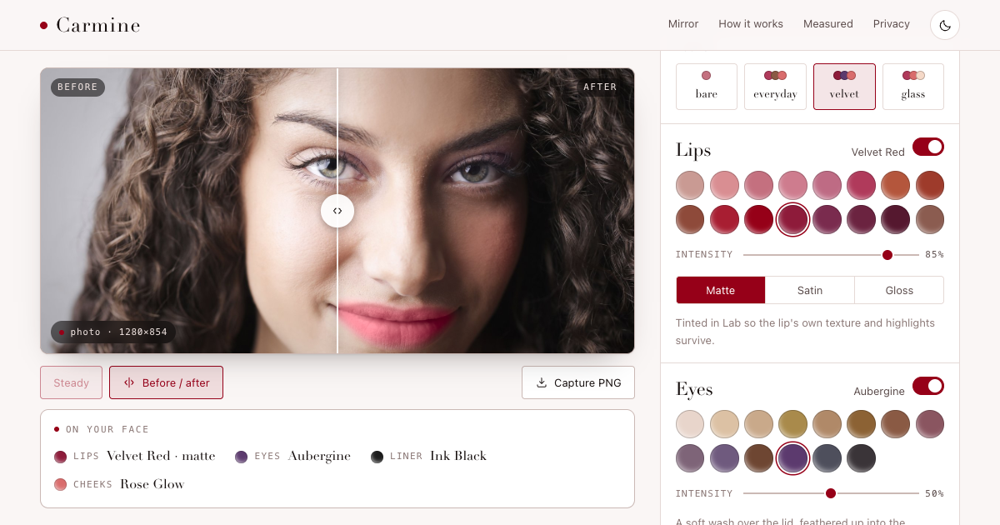
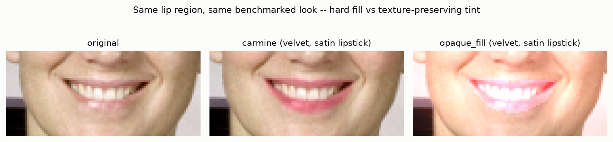

# Carmine

[](https://github.com/safdar-hussain1/carmine/actions/workflows/tests.yml)
[](LICENSE)

**Virtual makeup that leaves the skin looking like skin.** Carmine tints lips,
eyes, brows and cheeks in CIELAB, so the face keeps its own texture, highlights
and shadow instead of flattening into a sticker of solid colour. The same
algorithm ships twice: a Python engine and CLI for photos and video, and a live
mirror that runs on your camera in the browser, measured against the Python
renders pixel by pixel.

**[Try the live mirror →](https://safdar-hussain1.github.io/carmine/)**
Your camera, in your browser. No upload, no account, and every file it needs
comes from the page's own site.



---

## What it is

One algorithm, two surfaces.

| | Python engine | Browser mirror |
| --- | --- | --- |
| **For** | stills, video files, batch work, benchmarking | live camera try-on |
| **Runs** | `carmine` CLI or `import carmine` | one static page, no server |
| **Landmarks** | MediaPipe Tasks FaceLandmarker | the same model, as wasm |
| **Pigment** | NumPy + OpenCV in CIELAB | one WebGL2 fragment pass |
| **Masks** | full resolution, true Gaussian feathers | half resolution, box-approximated |

The browser is not a lookalike port. It is checked against the Python engine's
own renders, in a real browser, in CIELAB ΔE — see
[Parity](#parity-two-implementations-one-algorithm).


## How it works

Three stages, both surfaces:

1. **Find the face** — [`carmine/landmarks.py`](src/carmine/landmarks.py) /
   [`web/src/lib/landmarks.ts`](web/src/lib/landmarks.ts). 478 points per
   frame. Every dimension downstream is a fraction of the interocular
   distance, never a pixel count, so a 320px webcam frame and a 4000px
   portrait get makeup in the same relative place.
2. **Build soft masks** — [`carmine/masks.py`](src/carmine/masks.py) /
   [`web/src/engine/masks.ts`](web/src/engine/masks.ts). Each product is a
   polygon, a thick line or an ellipse, then feathered. The lip mask subtracts
   the inner mouth contour so colour never lands on teeth; eyeshadow carries a
   crease gradient, full at the lash line and 0.35 toward the brow.
3. **Tint in CIELAB** — [`carmine/pigment.py`](src/carmine/pigment.py) /
   [`web/src/engine/pigment.ts`](web/src/engine/pigment.ts). Chroma (a, b)
   moves toward the shade; lightness (L) is pulled at most a capped fraction
   of the way — 0.30 for matte lipstick and 0.35 for satin or gloss, 0.30
   eyeshadow, 0.20 brows, 0.15 blush, 0.10 highlighter. That cap is the whole
   trick. Eyeliner is the deliberate exception: a flat opaque paint, because
   covering what is underneath is the job.


The full write-up — pipeline demos, metric design, every negative result — is
in [`notebooks/01_engine_and_benchmarks.ipynb`](notebooks/01_engine_and_benchmarks.ipynb),
executed with outputs.

## Measured

Every measured number below comes from a committed machine-readable source,
[`reports/benchmark.json`](reports/benchmark.json) or
[`reports/browser_metrics.json`](reports/browser_metrics.json), or is computed
from one. The single exception, a pixel count from the run that diagnosed the
worst parity pixel, says so where it appears.

### Photo quality vs four standard failure modes

26 photographs (the no-makeup half of a local paired-portrait set; the photos
are private, the numbers are not). Every method runs the same look — velvet,
lipstick finish forced to satin, skin smoothing forced to 0 — and the four
baselines are faithful implementations of the ways AR makeup filters are known
to break, in [`carmine/baselines.py`](src/carmine/baselines.py).

| method | on-target ↑ | bg intact ↑ | texture ↑ | detail (diag.) | \|ΔL\| lip ↓ | identity ↑ | ms/img ↓ |
| --- | --- | --- | --- | --- | --- | --- | --- |
| wrong indices | 0.369 | 1.000 | 0.820 | 1.360 | 3.8 | 0.980 | 5.2 |
| opaque fill | 0.998 | 1.000 | 0.987 | 0.952 | 45.7 | 0.996 | 11.2 |
| channel swap | 0.144 | 0.017 | 0.976 | 0.801 | 31.3 | 0.993 | 226.5 |
| untrained GAN | 0.087 | 0.000 | −0.230 | 0.368 | 87.5 | 0.587 | 38.1 |
| **carmine** | **0.838** | **1.000** | **0.988** | 0.754 | **13.2** | **0.998** | 234.5 |

Three caveats, because the table alone would flatter:

- **`on-target` is adversarial to feathering on purpose.** It is a strict
  membership test at mask value > 0.05, not a soft weighting, so a feathered
  edge spreads change into low-mask pixels the cutoff then counts against it.
  Carmine's 0.838 is a soft edge being penalised by a hard threshold.
- **`opaque fill`'s 0.998 proves its indices, not its blend.** It shares its
  region geometry with the scorer; containment structurally cannot tell a hard
  fill from a soft tint once the geometry is right.
- **`detail` is a diagnostic, not a ranking.** Carmine's 0.754 is below two
  baselines. `wrong indices` scores 1.360 because it paints the wrong region
  entirely and leaves the scored lip nearly untouched; an additive fill
  preserves relative variation until saturation. Carmine's own figure is
  depressed by design — the lightness-pull cap scales down high-frequency L
  variance by about that fraction — and it is published as measured.

**Where the fill actually fails is brightness.** 45.7 against 13.2 Lab-L units
of mean lip-lightness shift: the fill moves the lip 3.5× further on a 0–100
scale, which is what a lip that no longer matches the face it is on looks like
numerically.



Carmine is also the slowest method in the table, at 234 ms per image. That is
the Python reference path — full-resolution masks, true Gaussians — written to
be verifiable rather than fast. The path that has to hit frame rate is the
browser's, measured below.

### Stability: a null result

Landmark detectors jitter, and the standard answer is a One-Euro filter.
Measured on a 90-frame synthetic clip with a known affine motion path (so lag
and jitter can be told apart), across a 12-point (min_cutoff, beta) sweep, it
did not earn a default:

| stream | deviation px/iod | jitter px/iod |
| --- | --- | --- |
| raw, no filter | 0.0113 | 0.00246 |
| One-Euro, best tuned (1.5, 0.5) | 0.0155 | 0.00227 |
| One-Euro, shipped defaults (1.0, 0.007) | 0.0520 | 0.00426 |

Best tuned: **7.6% jitter reduction against a 20% bar.** The filter's own
shipped defaults are worse than doing nothing on this clip — 4.6× the
deviation from ground truth and **73% more** jitter, because a low beta lags a
nearly-still stream. So no default was changed: smoothing stays available
(`VideoEngine(look, smooth_landmarks=…)`, `--no-smooth-landmarks`) as an
opt-in for genuinely jittery cameras. The clip is clean by construction, which
is exactly the case where smoothing should be expected to lose.

### Parity: two implementations, one algorithm

Three frames × three looks, compared in CIELAB ΔE in a real browser, driven
headlessly by `scripts/verify_site.py --with-parity`. Both tables, because
publishing only the first would be misleading.

| worst of 9 cases | mean ΔE | p99 ΔE | max ΔE | changed outside |
| --- | --- | --- | --- | --- |
| same landmarks, both engines | 0.747 | 2.763 | 11.434 | 0 |
| end-to-end, each its own landmarker | 2.717 | 18.454 | 30.135 | 0 |

Gates the in-browser selftest enforces: mean < 2.0, p99 < 5.0, max < 12.0, outside = 0.

Row one is the rendering claim: given identical landmarks the two engines
agree below the threshold of a just-noticeable colour difference, and not one
pixel moves outside the region either engine painted. The worst single pixel,
11.434, is understood: the diagnostic run behind it found 23 pixels in 388,800
above ΔE 6, all on the boundary of the two-pixel eyeliner stroke, where a
one-pixel rasterisation disagreement has nothing to hide behind.

Row two is the honest one: let each side run its own landmark detector and the
worst mean rises from 0.747 to 2.717 and the worst p99 from 2.763 to 18.454 —
3.6 and 6.7 times the rendering disagreement. Nothing about the rendering
changed: that gap is the two detector builds placing the same face a fraction
of a pixel apart. The pigment maths is not the risk on this pipeline. The
landmarker is.

### Timing: what a live frame costs

1280×720, 120 frames after 10 warm-up, medians, GPU draw fenced with
`gl.finish()`. Face close to the camera — interocular ≈ 199px at processing
resolution — so mask cost is the expensive case, not a flattering one.
**Hardware: Apple M1 Pro, Chrome via ANGLE/Metal.**

| stage | median ms | min | max |
| --- | --- | --- | --- |
| detect (wasm landmarker) | 17.5 | 12.2 | 24.6 |
| masks, live path | 7.3 | 6.4 | 13.2 |
| draw, fenced | 1.8 | 1.5 | 4.4 |
| **total, live path** | **26.6** | | |
| masks, exact path (reference) | 357.6 | 351.9 | 414.6 |

**26.6 ms/frame ≈ 37.6 fps.** Detection is two-thirds of that; the entire GPU
draw is 1.8 ms. The mask stage goes from 357.6 ms to 7.3 ms (≈49×) on the live
path by halving the processing long side and swapping true Gaussians for box
approximations — a documented approximation, labelled as one everywhere, and
never the thing parity is measured against.

## Install

```bash
git clone https://github.com/safdar-hussain1/carmine.git
cd carmine
python3 -m venv .venv && source .venv/bin/activate
pip install -e ".[dev]"      # [dev] adds pytest and scikit-image; plain `-e .` is enough to run it
export CARMINE_MODEL="$PWD/web/public/models/face_landmarker.task"
carmine looks                # prints the four presets if the install worked
```

Python 3.10 to 3.14: CI runs 3.12 and 3.13 on Linux, and a clean install on
macOS passes the suite on all five. The engine needs the MediaPipe
FaceLandmarker model (~3.8 MB, Apache-2.0). It ships in this repository, and
`CARMINE_MODEL` points the engine at it. Without that variable the first run
downloads the same file to `~/.cache/carmine/` and checks it against a pinned
sha256.

For the browser mirror you also need Node.js (CI uses 22): `cd web && npm ci`.

**If something fails:**

- `error: Failed to download the FaceLandmarker model … CERTIFICATE_VERIFY_FAILED`
  — Python from the python.org macOS installer has no CA certificates until you
  run `Install Certificates.command` from its folder in Applications. Or skip
  the download: set `CARMINE_MODEL` as above.
- `ModuleNotFoundError: No module named 'carmine'` although `pip install -e .`
  succeeded — the editable install points at the folder it was made from, so
  it breaks if the repository is moved or renamed, and some virtualenv setups
  never pick it up. Put the source on the path for that shell instead:
  `export PYTHONPATH=src` from the repository root.

## Every command

Run from the repository root with the virtualenv active. `IN`/`OUT` are your
own files; `web/public/demo/model.jpg` is a sample portrait to try.

```bash
# --- the CLI (also runs as `python -m carmine ...`) -----------------------------
carmine looks                                    # the presets: bare, everyday, glass, velvet
carmine looks --json                             # every preset as Look JSON, keyed by name
carmine looks --json | python -c "import json, sys; json.dump(json.load(sys.stdin)['velvet'], sys.stdout)" > look.json
#   one entry on its own is a --look-json file; edit colours and intensities there

carmine apply IN.jpg OUT.jpg --preset velvet     # --preset bare | everyday | glass | velvet
carmine apply IN.jpg OUT.jpg --look-json look.json
carmine apply IN.jpg OUT.jpg --preset bare \
    --lipstick '#8E1B3A' --lipstick-intensity 0.85 --lipstick-finish matte \
    --eyeshadow '#5C3A6E' --eyeshadow-intensity 0.5 \
    --eyeliner '#1B1B1B' --eyeliner-intensity 0.8 \
    --brows '#4A3728' --brows-intensity 0.35 \
    --blush '#D96C6C' --blush-intensity 0.35 \
    --highlighter '#F5D9C8' --highlighter-intensity 0.6 \
    --smoothing 0.25
#   colours are #RRGGBB; intensities and --smoothing are 0 to 1;
#   --lipstick-finish matte | satin | gloss. A colour without its -intensity
#   flag turns that product on at 0.7, or keeps the preset's own intensity.
#   Without --preset or --look-json every product starts switched off.

carmine video IN.mp4 OUT.mp4 --preset glass      # every frame, at the source fps and size
carmine video IN.mp4 OUT.mp4 --look-json look.json --no-smooth-landmarks
carmine landmarks IN.jpg OUT.jpg                 # the 478 detected points as dots, a debug aid

# --- the Python API ----------------------------------------------------------------
python -c "import cv2; from carmine import apply_look, PRESETS; cv2.imwrite('out.jpg', apply_look(cv2.imread('web/public/demo/model.jpg'), PRESETS['velvet']))"

# --- tests ---------------------------------------------------------------------------
pytest                                           # 256 tests; the 5 that need the private dataset skip without it
(cd web && npx vitest run)                       # 76 tests of the browser engine
(cd web && npx tsc --noEmit)                     # type-check
python scripts/verify_site.py                    # the built site's own selftest, 9 checks, in headless Chrome
python scripts/verify_site.py --url 'https://safdar-hussain1.github.io/carmine/?selftest=1'   # ... on the live site
python scripts/mutation_battery.py               # breaks 12 claims one at a time; needs a clean git tree

# --- the browser mirror --------------------------------------------------------------
(cd web && npm run dev)                          # dev server with live reload, http://localhost:5173
(cd web && npm run build)                        # writes docs/, the site GitHub Pages serves
python3 -m http.server 8000 --directory docs     # the built site at http://localhost:8000

# --- regenerate what the repository commits (see the table below first) --------------
python scripts/export_constants.py               # web/src/gen/constants.json, from the Python source
python scripts/export_test_vectors.py            # web/src/gen/test_vectors.json, from the Python engine
python scripts/make_figures.py                   # reports/figures/: benchmark_metrics, presets_demo, opacity_compare
python scripts/preview_masks.py                  # reports/figures/masks_demo.png
python scripts/make_demo_portrait.py             # web/public/demo/portrait.jpg, the selftest's fixed frame
python scripts/stability_bench.py                # reports/benchmark.json "stability"   [--out DIR]
python scripts/benchmark.py                      # reports/benchmark.json "photo"; needs data/no_makeup/   [--dataset DIR --out DIR --max-side N]
python scripts/export_parity_fixtures.py         # reports/parity_fixtures/ (git-ignored); needs data/no_makeup/   [--dataset DIR --out DIR]
python scripts/verify_site.py --with-parity      # parity and SwiftShader timing into reports/browser_metrics.json   [--metrics-out PATH]
python scripts/verify_site.py --timing-only      # timing on the real GPU, added to the same file as timing_hardware
pip install nbclient ipykernel && python scripts/build_notebook.py --execute   # the notebook, written and run
python scripts/make_og_image.py                  # web/public/og-image.png, the link-preview picture; build again after
```

`verify_site.py` also takes `--timeout SECONDS` (default 120; 900 for
`--with-parity` and `--timing-only`) and `--expect-checks N` (default 9; `0`
turns the count check off). `build_notebook.py` takes `--kernel NAME` (default
`python3`); `make_og_image.py` takes `--theme light|dark` and `--out PATH`.

**Why the built site needs a server.** `docs/index.html` loads its script as an
ES module and its stylesheet with `crossorigin`, and fetches the face model and
the wasm runtime when the mirror opens. Browsers refuse all of that from a
`file://` page, so opening the file directly shows an unstyled headline and
nothing else. Any static server works; the one above ships with Python.

**Commands that rewrite committed files.** Most of the list above is safe to
run at any time. These are not, because their output differs from what is
committed, and some tests read that output:

| command | what changes |
| --- | --- |
| `scripts/benchmark.py` | `reports/benchmark.json`: every `ms_per_image` moves with machine load. The quality figures were measured with OpenCV 4.13, which reproduces them exactly; a fresh install gets OpenCV 4.14, which moves some baseline cells in the third decimal (Carmine's own row holds at the published precision) |
| `scripts/stability_bench.py` | `reports/benchmark.json`: only `video_ms_per_frame` moves |
| `scripts/verify_site.py --with-parity` | `reports/browser_metrics.json`: the SwiftShader timing, and the end-to-end row by a few thousandths (runs today give a worst mean of 2.7155 against the committed 2.7170), which `tests/test_docs_numbers.py` pins, so `pytest` goes red. Pass `--metrics-out` elsewhere to keep the committed file |
| `scripts/verify_site.py --timing-only` | `reports/browser_metrics.json`: the published 26.6 ms, which `tests/test_docs_numbers.py` pins, so `pytest` goes red |
| `scripts/make_figures.py` | its three figures: the same pictures, but each PNG records the local matplotlib version, and two come out a pixel or two wider |
| `scripts/build_notebook.py` | without `--execute`, the notebook written back with no outputs; with it, new timestamps and log lines |
| `scripts/make_og_image.py` | `web/public/og-image.png`, a fresh screenshot every run |

`git checkout -- <path>` puts any of them back. Everything else in the list
reproduces the committed bytes: the two generated JSON files (the tests check
those), the mask preview, the demo portrait and the built site.

## The mirror

What runs where: the camera frame goes from the video element into a GPU
texture and back to a canvas. The only data crossing into JavaScript is 478
landmark coordinates and, for gloss finishes, two percentile numbers. All six
products composite in a single fragment pass — no intermediate buffers, which
on a phone would cost more than every colour operation combined.

**Privacy is a claim about network traffic, so it is checkable.** The landmark
model and the wasm runtime are served from the same origin instead of a CDN,
type is set in system fonts, and there are no analytics: every request the page
makes goes to its own site, and once the mirror has loaded its model (the first
time you open it) it makes **no** further requests. Open the Network panel,
reload, open the mirror, then change shades and capture: the list stops
growing. Or turn the network off once the mirror is running and keep using it.
Captures save through your own browser's download; nothing is written anywhere
else.

The built site carries its own acceptance test. Load it with `?selftest=1` and
the tab title reports the result — `SELFTEST PASS n=9 skipped=2` on the
deployed site, where the two parity checks have no fixtures to compare against
and say so rather than passing quietly. `python scripts/verify_site.py`
drives that headlessly and fails if the count changes. The nine checks include
the ones only a browser can run — a real driver compiling the fragment shader,
the wasm landmarker actually finding a face in the bundled portrait, and the
parity comparison against the Python renders.

Public cards, served with the site:
[design and measured claims](web/public/DESIGN_CARD.md) ·
[architecture](web/public/ARCHITECTURE.md).

## Repo tree

```
src/carmine/          the engine: landmarks, regions, masks, pigment, look, engine, cli
                      plus baselines.py (failure modes) and metrics.py (scorers)
web/index.html        the page template: head, search and link-preview metadata
web/src/engine/       the browser port: masks, pigment, colour, blur, look, renderer
web/src/ui/           the mirror: stage, shade rail, measured section, pipeline
web/src/lib/          landmarker, camera, selftest, parity and timing harnesses
web/src/gen/          constants.json + test_vectors.json, generated from Python
web/public/           bundled model and wasm, demo portraits, favicon, og-image,
                      sitemap, DESIGN_CARD, ARCHITECTURE
scripts/              benchmark, stability_bench, figures, mask preview, demo portrait,
                      constants/vector/fixture export, verify_site (headless browser),
                      build_notebook, mutation_battery, make_og_image
tests/                256 pytest tests
notebooks/            the executed engineering write-up
reports/              benchmark.json, browser_metrics.json, figures/
docs/                 the built site (GitHub Pages)
.github/workflows/    CI: tests.yml
```

## Tech stack

**Python** 3.10–3.14 · NumPy · OpenCV · MediaPipe Tasks · scikit-image
(metrics, demo portrait) · pytest.
**Web** TypeScript · Vite · WebGL2 (one fragment pass) ·
`@mediapipe/tasks-vision` wasm · vitest. No UI framework, no CSS framework, no
runtime dependency beyond the landmarker.

## Tests

```bash
pytest                                  # 256 tests
(cd web && npx vitest run)              # 76 tests
python scripts/verify_site.py           # headless browser selftest, 9 checks
```

**CI** ([`.github/workflows/tests.yml`](.github/workflows/tests.yml)) runs on
every push and pull request to `main`: `pytest` on Python 3.12 and 3.13, and a
web job that runs `npm ci`, vitest, the type-check and the production build,
then fails if the build differs from the committed `docs/`. Two things it does
not run: the five parity-fixture tests, which render from the private
portrait dataset and skip without it (251 pass, 5 skip), and
`scripts/verify_site.py`, which needs Chrome with WebGL2 and is run locally
before publishing. No test needs a camera.

What they pin, beyond the usual:

- **Cross-surface parity.** `tests/test_parity_report.py` validates the
  committed `browser_metrics.json` against the same ΔE gates the browser
  enforces, and never skips — a stale number cannot survive a change to the
  code that produced it. `web/src/gen/test_vectors.json` holds Python-produced
  vectors that the TypeScript engine is checked against unit by unit.
- **Constants cannot drift.** `tests/test_constants_sync.py` regenerates
  `web/src/gen/constants.json` from the Python source and diffs it, so a
  feather radius changed on one side and not the other is a red build.
- **Metric falsification.** `tests/test_metrics.py` feeds each scorer the case
  it is supposed to catch — a flat fill that fools a correlation metric, an
  additive shift that fools containment — so the published metrics are pinned
  against the blind spots they were designed around, and the committed
  benchmark's own orderings and schema are re-checked on every run.
- **Published numbers.** `tests/test_docs_numbers.py` derives the headline
  figures this README and the design card quote (containment, lip-lightness
  shift, both parity rows and their ratio, the live frame time) from the two
  JSON reports and fails if the prose stops matching.
- **The published page.** `tests/test_published_site.py` checks the page
  template and the committed build for the search and link-preview metadata,
  the one `<h1>`, the sitemap, the 1200×630 link-preview image and the
  authorship marks.
- **Repository hygiene.** `tests/test_guards.py` scans every tracked text file
  for leaked absolute paths and stray process documents. It scans this README,
  the notebook and the cards too.

### Mutation battery

A test suite passing proves nothing about a claim it was never asked to
catch. `scripts/mutation_battery.py` breaks each headline claim above on
purpose — one at a time, by editing the exact line that makes it true — and
checks that a *named* test goes red. Then it restores the file byte-for-byte
and confirms that same test is green again. A claim whose mutation doesn't
flip any test to red is reported as a survivor: a real gap, not a passing
suite that happens to agree with the docs.

```bash
python scripts/mutation_battery.py
```

| claim broken | killer test |
| --- | --- |
| lipstick stays off teeth/mouth interior | `test_masks.py::TestLipMask::test_near_zero_at_mouth_opening_centroid` |
| tint never touches pixels outside its mask | `test_pigment.py::TestUntouchedRegionIsPreserved::…[tint-kwargs0]` |
| tint keeps skin texture | `test_pigment.py::TestTint::test_preserves_texture_detail` |
| One-Euro filter matches its own reference trace | `test_constants_sync.py::test_test_vectors_json_matches_generator` (TS trace test is a candidate killer, pinned to committed fixtures) |
| `constants.json` matches its generator | `test_constants_sync.py::test_constants_json_matches_generator` |
| `test_vectors.json` matches what Python produced | `test_constants_sync.py::test_test_vectors_json_matches_generator` (+ TS pinning test) |
| `opaque_fill` is measurably worse than the real engine | `test_baselines.py::TestOpaqueFill::test_erases_lip_texture` |
| containment ignores a feathered mask's soft tail | `test_metrics.py::TestPigmentOnTarget::test_feathered_tail_below_threshold_does_not_count_as_inside` |
| `data/` stays git-ignored | `test_guards.py::test_private_paths_are_ignored` |
| no tracked file contains a banned word | `test_guards.py::test_no_banned_words_in_tracked_files` |
| published CPU ΔE is inside the browser's own gate | `test_parity_report.py::test_cpu_parity_is_within_the_published_thresholds` |
| committed benchmark numbers stay internally consistent | `test_metrics.py::TestBenchmarkJsonSchema::test_photo_section_schema` |

## License

MIT — see [LICENSE](LICENSE). The FaceLandmarker model is Apache-2.0. The
canned frame the selftest renders is a NASA photograph, public domain. Sample
portrait: photo by Andrea Piacquadio on Pexels, Pexels license.
