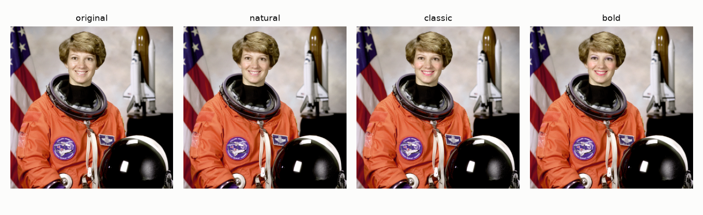
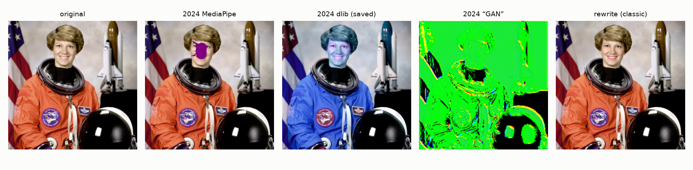
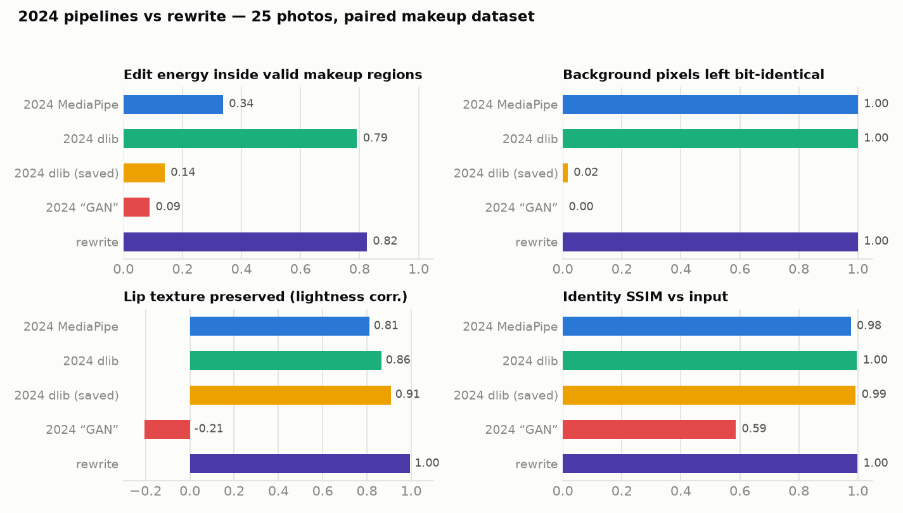
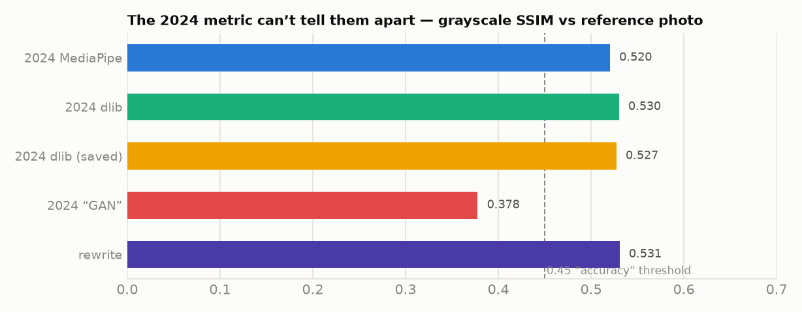

# Virtual Makeup

**Landmark-driven virtual makeup that recolors lips, lids and cheeks without destroying skin texture — rebuilt from a 2024 course project whose every output and every metric turned out to be broken.**

[**Live dashboard & in-browser try-on**](https://safdar-hussain1.github.io/virtual-makeup/) · [The audit notebook](notebooks/01_audit_and_rewrite.ipynb)



## What this is

A Python package + CLI that applies configurable makeup (lipstick, eyeshadow, eyeliner, blush, skin smoothing) to portrait photos:

- **MediaPipe FaceMesh** (468 landmarks) for face geometry.
- **Soft, face-scaled masks** — every feather radius, liner thickness and blush axis is a fraction of the interocular distance, so one look renders identically on a 400 px selfie and a 4000 px portrait. The lip mask is the outer contour *minus the mouth opening*, so lipstick never paints teeth.
- **Texture-preserving color in CIELAB** — pigment pulls the chroma (a/b) channels toward the target color while lightness keeps most of the original detail. Pores, highlights and lip creases survive recoloring.
- **Fail-fast validation** — bad hex colors, out-of-range intensities and malformed images are rejected with every error listed, before any processing.

The repo also contains a faithful, bug-for-bug reproduction of the original 2024 pipelines ([`src/virtual_makeup/legacy.py`](src/virtual_makeup/legacy.py)) and a benchmark that runs old vs new on 25 real photos — because the honest correction *is* the project.

## What was wrong with the original

I built the first version of this in 2024 for a Digital Image Processing course. The outputs were visibly broken, and the report's metrics said everything was fine. The audit found five independent problems:

| # | Bug | Effect |
|---|-----|--------|
| 1 | **dlib's 68-point indices applied to MediaPipe's 468-point mesh** (`lips = landmarks[48:60]`) | "Lipstick" rendered as purple polygons across the chin and jaw |
| 2 | **`cv2.COLOR_RGB2BGR` on an already-BGR image at save time** | Every saved output had red/blue swapped — entirely blue faces |
| 3 | **The "GAN" was never trained** — a random-weight 3-layer conv net run in inference | Its "makeup" outputs are noise by construction; metrics were still reported for it |
| 4 | **Opaque `fillPoly` lipstick over landmarks 48–68 + fixed ±10/±20 px eyeshadow offsets + additive `addWeighted` compositing** | Painted-over teeth, effects that only fit one image size, blown-out brightness |
| 5 | **Evaluation with `y_true` all ones** | "Precision = 1.0" is guaranteed for *any* output, including untrained noise; "accuracy 0.88" just counts SSIM scores above an arbitrary 0.45 threshold |



## Benchmark — old vs new on 25 real photos

`scripts/benchmark.py` runs every 2024 variant and the rewrite on the no-makeup half of the paired makeup dataset the course used, and scores four honest metrics per image (all reproduced in this repo, figures included):

| method | containment ↑ | background integrity ↑ | lip texture ↑ | identity SSIM ↑ | ms/image |
|---|---|---|---|---|---|
| 2024 MediaPipe | 0.337 | 1.000 | 0.811 | 0.976 | 7.4 |
| 2024 dlib | 0.791 | 1.000 | 0.865 | 0.997 | 12.8 |
| 2024 dlib (as saved) | 0.140 | 0.017 | 0.908 | 0.993 | 12.4 |
| 2024 "GAN" | 0.089 | 0.000 | −0.205 | 0.586 | 41.2 |
| **rewrite (classic)** | **0.825** | **1.000** | **0.996** | **0.998** | 285 |

- **containment** — share of edit energy inside legitimate makeup regions (lips/lids/lashes/cheeks). The rewrite's 0.825 is against a strict region cutoff; at any non-zero mask threshold it is exactly 1.0 by construction — the engine cannot write outside its masks, and the test suite asserts the background stays bit-identical.
- **background integrity** — fraction of pixels outside the face left untouched. The channel-swap bug (row 3) recolors 98% of the image; the "GAN" replaces all of it.
- **lip texture** — correlation of lip-region lightness before/after. Flat fills destroy it; the Lab-space tint keeps 0.996. Note the legacy MediaPipe row scores 0.811 only because it usually *missed* the lips entirely.
- The rewrite is slower (285 ms/photo) — it builds five feathered float masks per face. Fine for photo processing; the [browser demo](https://safdar-hussain1.github.io/virtual-makeup/) runs interactively.



### Re-running the original evaluation (and why it was meaningless)

The 2024 report claimed SSIM (MediaPipe) = 0.515, SSIM (dlib) = 0.518, "accuracy 0.88, precision 1.0". Re-running the identical protocol today:

| method | SSIM vs reference | "accuracy" @0.45 | "precision" |
|---|---|---|---|
| 2024 MediaPipe | 0.520 | 0.680 | 1.0 |
| 2024 dlib | 0.530 | 0.880 | 1.0 |
| 2024 dlib **(blue-face bug)** | **0.527** | 0.800 | 1.0 |
| 2024 "GAN" (noise) | 0.378 | 0.240 | 1.0 |
| rewrite | 0.531 | 0.880 | 1.0 |

The old numbers replicate (0.52/0.53 vs the reported 0.515/0.518) — and that's the problem. A **completely blue face scores 0.527**, statistically identical to the best method, because grayscale SSIM is blind to color and makeup *is* color. And precision is 1.0 for everything — including untrained noise — because `y_true` was all ones. The metric could not fail.



## Install & use

Requires Python ≥ 3.10. The FaceMesh model (~3.7 MB) downloads automatically on first run (or set `VMAKEUP_MODEL` to a local copy).

```bash
git clone https://github.com/safdar-hussain1/virtual-makeup
cd virtual-makeup
pip install -e .
```

Apply a look:

```bash
vmakeup apply selfie.jpg out.jpg --preset classic
vmakeup apply selfie.jpg out.jpg --lipstick "#8E1B3A" --lipstick-intensity 0.9 \
    --eyeshadow "#5C3A6E" --blush "#C25B5B" --smoothing 0.3
vmakeup landmarks selfie.jpg debug.jpg   # render the 468 detected points
```

Or from Python:

```python
import cv2
from virtual_makeup import MakeupLook, apply_makeup

image = cv2.imread("selfie.jpg")
look = MakeupLook(lipstick_color="#B03A5B", lipstick_intensity=0.75,
                  blush_color="#D96C6C", blush_intensity=0.35, smoothing=0.25)
cv2.imwrite("out.jpg", apply_makeup(image, look))
```

Presets: `natural`, `classic`, `bold` (see [`config.py`](src/virtual_makeup/config.py)).

### Tests

```bash
pip install -e ".[dev]"
pytest            # 50 tests
```

The suite covers config validation, mask geometry (lipstick excludes the mouth opening; masks scale ~4× when the image doubles), texture preservation, bit-identical backgrounds, CLI error paths — and pins down each legacy bug so the audit claims stay verifiable.

### Reproducing the benchmark

The dataset (26 paired no-makeup/with-makeup photos) and dlib's 68-point shape predictor are **not** committed (faces of private individuals; a 99 MB model). To reproduce:

1. Get the paired makeup dataset (the Kaggle "makeup dataset" with `no_makeup/`, `with_makeup/`, `make_up.csv`).
2. `curl -LO http://dlib.net/files/shape_predictor_68_face_landmarks.dat.bz2 && bunzip2 shape_predictor_68_face_landmarks.dat.bz2`
3. ```bash
   pip install -e ".[dev]"
   python scripts/benchmark.py --dataset path/to/dataset \
       --shape-predictor shape_predictor_68_face_landmarks.dat
   python scripts/make_figures.py
   ```

One dataset image (24.jpg) is skipped — dlib finds no frontal face in it.

## Repo structure

```
├── src/virtual_makeup/
│   ├── regions.py      # canonical FaceMesh index sets (lips, eyes, brows, oval)
│   ├── landmarks.py    # MediaPipe Tasks FaceLandmarker wrapper + input validation
│   ├── masks.py        # soft, interocular-scaled region masks
│   ├── blend.py        # CIELAB tint / flat paint / bilateral smoothing
│   ├── makeup.py       # apply_makeup pipeline
│   ├── config.py       # MakeupLook dataclass + presets, fail-fast validation
│   ├── legacy.py       # bug-for-bug 2024 reproduction (for the benchmark)
│   ├── models.py       # FaceMesh model auto-download
│   └── cli.py          # vmakeup apply / landmarks
├── tests/              # 50 pytest tests
├── scripts/            # benchmark.py, make_figures.py, build_notebook.py
├── notebooks/          # executed audit + rewrite narrative
├── reports/            # benchmark.json + figures
└── docs/               # GitHub Pages dashboard with in-browser try-on
```

## Tech stack

Python · OpenCV · MediaPipe Tasks (FaceLandmarker) · NumPy · scikit-image · dlib (legacy reproduction only) · pytest · MediaPipe Tasks Vision JS + Chart.js (dashboard)

Demo portraits use the public-domain NASA photo of Eileen Collins bundled with scikit-image. No dataset photos are committed.

## License

[MIT](LICENSE)
